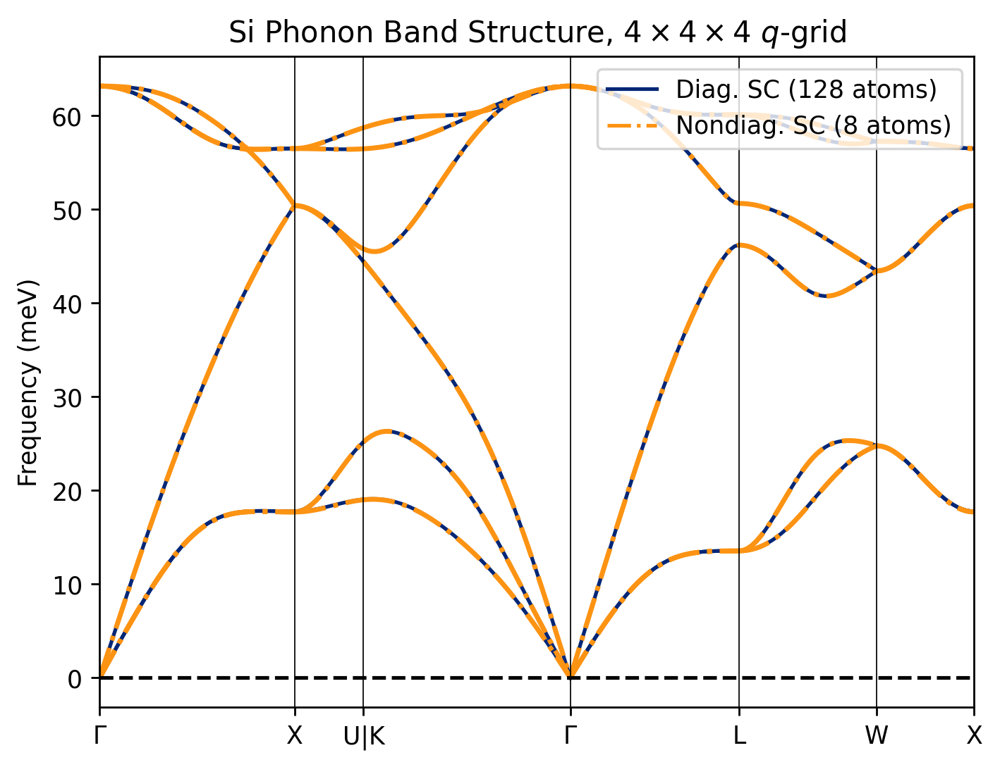

# Tutorial

In this short tutorial, we will work through the process of computing the phonon dispersion of Silicon on a $4 \times 4 \times 4$ $q$-grid using the nondiagonal supercell (NDSC) method. We will use VASP as the force calculator, but the process is similar for every other DFT code supported by phonopy. We assume the reader is already familiar with phonopy and the basics of phonon calculations. 

The files for this tutorial are available in the `example` directory of the Quesadilla repository.

## Step 1: Generate supercells with displacements

The first step is always to generate supercells with displacements, and the Quesadilla command line interface is very similar to phonopy's. With phonopy, you would run something like `phonopy -d --dim 4 4 4`, perhaps with extra arguments (e.g., `phonopy --qe -d --dim 4 4 4 -c pw.in` for QE). Quesadilla supports all force calculators suppported by phonopy, as well as all the arguments used to control displacements (e.g., `--pm`, `--trigonal`, etc.)

To generate NDSCs, you can run the exact same command you'd want to run with `phonopy`, but replace `phonopy` with `quesadilla`:

```bash
# Assumes you use VASP and POSCAR is in current directory
quesadilla -d --dim 4 4 4
```
with output
```
Standard primitive cell written to PPOSCAR
We have 8 q-points in IBZ necessitating 8 supercells with total size  25
After minimization, we only need 5 supercells with total size  20
Supercells written to quesadilla.toml
Warning: Point group symmetries of supercell and primitivecell are different.
Nondiagonal supercell 1 needs 2 displacements.
Nondiagonal supercell 2 needs 2 displacements.
Nondiagonal supercell 3 needs 2 displacements.
Nondiagonal supercell 4 needs 4 displacements.
Nondiagonal supercell 5 needs 2 displacements.
```
You can ignore the point group warnings, see [this issue](https://github.com/oashour/quesadilla/issues/19)

The directory structure after running this command should automatically look like this:

```
.
├── POSCAR
├── PPOSCAR
├── quesadilla.toml
├── sc-001
│   ├── POSCAR
│   ├── POSCAR-001
│   ├── POSCAR-002
│   ├── SPOSCAR
│   └── phonopy_disp.yaml
├── sc-002
│   ├── POSCAR
│   ├── POSCAR-001
│   ├── POSCAR-002
│   ├── SPOSCAR
│   └── phonopy_disp.yaml
├── sc-003
│   ├── POSCAR
│   ├── POSCAR-001
│   ├── POSCAR-002
│   ├── SPOSCAR
│   └── phonopy_disp.yaml
├── sc-004
│   ├── POSCAR
│   ├── POSCAR-001
│   ├── POSCAR-002
│   ├── POSCAR-003
│   ├── POSCAR-004
│   ├── SPOSCAR
│   └── phonopy_disp.yaml
└── sc-005
    ├── POSCAR
    ├── POSCAR-001
    ├── POSCAR-002
    ├── SPOSCAR
    └── phonopy_disp.yaml
```

!!! note "What Queasdilla is doing under the hood"

    In a conventional `phonopy` calculation, `phonopy -d --dim 4 4 4` would have produced a pristine 4x4x4 supercell file (e.g., `SPOSCAR`), some supercells with displacements (e.g., `POSCAR-00{1,2,3...}`) and a `phonopy_disp.yaml` in the current directory. With quesadilla, it's a little more involved. Under the hood, quesadilla is doing the following:

    1. First, `quesadilla` will find a standard primitive cell. This is similar to running `phonopy --symmetry`. This standard primitive cell is what will be used to build the nondiagonal supercell, and will be saved in a file `PPOSCAR` in the current directory.
    2. Next, quesadilla will figure out the minimum number of nondiagonal supercells necessary to span the 4x4x4 q-grid, build them, and then Minkowski reduce them. These files will be placed in the directories `sc-{001,002,...}`, each corresponding to a nondiagonal supercell. Each NDSC will be in, e.g., the `sc-*/SPOSCAR` file for VASP. The standard primitive file will also be placed in these directories as `POSCAR`
    3. Next, quesadilla will generate the displacemnts in each of these supercells, producing the files `sc-*/POSCAR-*`. This would be similar to running `phonopy -d --dim <ndsc matrix>` on every single supercell. Each `sc-*` folder will also have a `phonopy_disp.yaml` file, which can be used for debugging if necessary, and will be read later when creating the force sets.
    4. Finally, a file `quesadilla.toml` will be written in the current, which contains all the information about the supercells and which $q$-points they are commensurate with. All subsequent commands will read this file.

!!! question "Why so many displacements?"

    You'll notice that the 5 nondiagonal supercells have 2 displacements each, except for the 4th supercell, which has 4 displacements. If you run `phonopy -d --dim 4 4 4`, you'll only get one supercell with displacement. This is because the nondiagonal supercells have lower symmetry than diagonal supercells, so you need more displacements to get the force constant matrix. For Si on a $4 \times 4 \times 4$ $q$-grid, a standard diagonal supercell calculation would require 1 DFT calcualtion for a supercell with 128 atoms, while the NDSC method requires a total of 12 DFT calculations for supercells with 8 atoms each. 


## Step 2: run the DFT calculations

As usual with `phonopy`, we now have to run the DFT calculations on the supercells with the displacements. We will place each `POSCAR-xxx` in a directory `disp-xxx` and run the calculation there (e.g., `POSCAR-002` should go in a directory `disp-002`). While this directory structure is optional for phonopy, it is mandatory for quesadilla. This needs to be repeated for every single supercell (i.e., for each `sc-*` directory). Optionally, the forces in the pristine supercell can also be calculated so they can be subtracted from the force sets in the next step. If this is desired, the pristine supercell calculation (e.g., the `SPOSCAR` file) should be run in the `disp-000` folder.

!!! warning "Be careful with $k$-points!"

    With diagonal supercells, it's easy to choose the $k$-points for each DFT calculation in the supercell. For example, if your primitive cell was converged with an $8 \times 8 \times 8$ $k$-grid, then a $4 \times 4 \times 4$ supercell would have the same $k$-point density with a $2 \times 2 \times 2$ grid instead.

    The situation is a little trickier with NDSCs and the $k$-grid used for each NDSC will be different. The easiest option is to use an external tool to generate necessary grid that maintains the desired $k$-point spacing. The script `example/generate_kpoints.py` shows how to do this with `pymatgen`. 

    Also note that, given the lower symmetry and weird shape of NDSCs, you will sometimes see this warning in VASP:

    ```
     -----------------------------------------------------------------------------
    |                                                                             |
    |           W    W    AA    RRRRR   N    N  II  N    N   GGGG   !!!           |
    |           W    W   A  A   R    R  NN   N  II  NN   N  G    G  !!!           |
    |           W    W  A    A  R    R  N N  N  II  N N  N  G       !!!           |
    |           W WW W  AAAAAA  RRRRR   N  N N  II  N  N N  G  GGG   !            |
    |           WW  WW  A    A  R   R   N   NN  II  N   NN  G    G                |
    |           W    W  A    A  R    R  N    N  II  N    N   GGGG   !!!           |
    |                                                                             |
    |     Your reciprocal lattice and k-lattice belong to different lattice       |
    |     classes:                                                                |
    |                                                                             |
    |        The reciprocal lattice is base-centered monoclinic,                  |
    |        whereas your k-lattice is triclinic.                                 |
    |                                                                             |
    |     Results are often still useful ...                                      |
    |                                                                             |
    -----------------------------------------------------------------------------
    ```

    In general, this is not a problem, but it may be best to use something more efficient than Monkhorst-Pack grids for the NDSCs, such as [autoGR](https://github.com/msg-byu/autoGR)


## Step 3: generate the force sets (`FORCE_SETS`)

Once the DFT calcualtions are done, we will need to generate the `FORCE_SETS` files, just as we would in `phonopy`. In phonopy, we would use something like `phonopy disp-00{1..4}/vasprun.xml` to read the forces from the `vasprun.xml` for the four supercells with displacements. Here, we have five nondiagonal supercells with varying numbers of displacements each. As mentioned earlier, 
Quesadilla **requires** your calculations to be structured so that `sc-001/POSCAR-001` (and the resultant `vasprun.xml` or similar output file) go into the folder `sc-001/disp-001`, etc. To generate the `FORCE_SETS` for all supercells with `quesadilla`, we can run from the root directory

```bash
quesadilla -f vasprun.xml
```

which is similar to running `phonopy -f disp-*/vasprun.xml` in every `sc-*` directory, generating one `FORCE_SETS` file per supercell. The output should look like
```
Working on supercell 1 in directory sc-001
Found 2 displacements.
Files to extract forces from:
['disp-001/vasprun.xml', 'disp-002/vasprun.xml']
Calculator interface: vasp
Displacements were read from "phonopy_disp.yaml".
counter (file index): 1 2
"FORCE_SETS" has been created.
------------------------------------
<repeat until sc-005>
```

If you want to use the `--force-sets-zero` option, subtracting the residual forces from the pristine supercell, then with quesadilla we'll run

```bash
quesadilla --force-sets-zero vasprun.xml
```

assuming the pristine supercell calculation was done in the `sc-*/disp-000` directories as explained in the previous section.

## Step 4: generate the force constants

Finally, we need to generate the force constants. This step is often skipped in `phonopy` and it is common to use the `FORCE_SETS` file directly. The command is (from the root directory)

```bash
quesadilla --fc
``` 
with output
```
Forces and displacements were read from "FORCE_SETS".
Force constants calculation using phonopy-traditional starts.
Max drift of force constants: 0.000001 (xx) 0.000001 (zz)
------------------------------------
<repeat for all supercells>
------------------------------------
Found 5 dynamical matrices at q = [0. 0. 0.]
Found 1 dynamical matrices at q = [0.25 0.   0.  ]
Found 1 dynamical matrices at q = [0.5 0.  0. ]
Found 1 dynamical matrices at q = [-0.25  0.25  0.  ]
Found 2 dynamical matrices at q = [0.5 0.5 0. ]
Found 1 dynamical matrices at q = [0.25 0.25 0.  ]
Found 1 dynamical matrices at q = [0.5  0.25 0.  ]
Found 1 dynamical matrices at q = [-0.25  0.5   0.25]
Creating the Phonopy object...
Fourier transforming the force constants back to real space...
Found 64 q-points in the full BZ
Running DynmatToForceConstants...
Applying acoustic sum rules...
```

this will produce a `phonopy.yaml` file in the root directory, containing the real space force constants for a **diagonal** $4 \times 4 \times 4$ supercell. This file can be used with `phonopy`, `phono3py`, or any other code that reads `phonopy.yaml` files.

For example, to plot the band structure, we could simply run, from the root directory:

```bash
phonopy-load --band auto -p phonopy.yaml
```

!!! note "What Queasdilla is doing under the hood"

    When the `quesadilla --fc` command is run, Quesadilla will read the `quesadilla.toml` file and then do the following:

    1. Read the the force sets (`FORCE_SETS`) file in each `sc-*` directory, and compute the real-space force constants for each NDSC. The results are stored in `sc-*/phonopy.yaml`, which is useful for debugging.
    2. Next, for each NDSC, it will Fourier transform the real-space force constants at the $q$-points each supercell is commensurate with.
    3. If a $q$-point is commensurate with multiple cells (such as the $\Gamma$ point, commensurate with all of them), the dynamical matrix is averaged. We now have the dynamical matrix at every $q$ point in the *iredducible* Brillouin zone.
    4. Next, quesadilla will symmetrize the Fourier-transformed dynamical matrix $D(q)$, using the symmetries of the little group of each q-point. This can get rid of small symmetry breaking problems that can happen in NDSCs.
    5. Using the symmetrized dynamical matrices, Quesadilla will calculate the star of each q-point in the iredducible brillouin zone, then use the appropriate representations of the operators, as well as and time reversal symmetry if applicable, to compute the dynamical matrix at every point in the star of q.
    6. Once this is done, we now have the dynamical matrix in the full Brillouin zone. We can now Fourier transform it to real space to obtain the force constant matrix of a diagonal 4x4x4 supercell.
    7. Finally, quesadilla will apply the acoustic sum rules (ASR) to enforce translational symmetry. The final real-space IFC for the equivalent $4 \times 4 \times 4$ diagonal supercell is written to `phonopy.yaml` in the root directory.

    If you would like to learn more about how this works, I would recommend starting with the [Chapter 2.1 of Volume D of the International Tables for Crystallography](https://onlinelibrary.wiley.com/doi/10.1107/97809553602060000911/full).

We can compare the results to a standard diagonal supercell calculation


